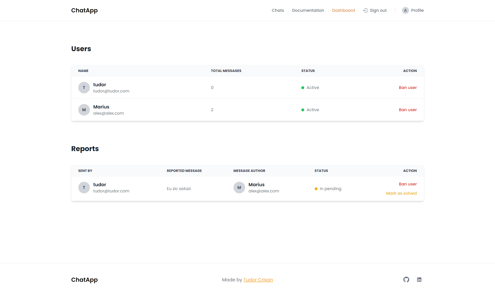

# Descriere Aplicație Chat - Proiect MAP

## Caracteristici Principale

- **Mesagerie:** Aplicație de chat pentru trimiterea de mesaje.
- **Autentificare și Înregistrare:** Posibilitatea de a te autentifica și înregistra folosind adresa de email, un nume de utilizator și o parolă.
- **Profil Personalizabil:** Opțiunea de a personaliza și actualiza profilul.
- **Conversații Grup și Individuale:** Capacitatea de a crea grupuri de discuție alături de alți utilizatori, dar și de a iniția conversații individuale.
- **Trimiteți Mesaje în Grupuri:** Abilitatea de a trimite mesaje în cadrul grupurilor create.
- **Raportare Mesaje:** Posibilitatea de a raporta mesaje inadecvate.
- **Funcționalități de Administrator:** Ca administrator, poți vizualiza toți utilizatorii și ai opțiunea de a impune restricții (blocare).
- **Gestionarea Rapoartelor:** Poți accesa și evalua toate rapoartele primite de la alți utilizatori.

## Tehnologii Folosite

- **Laravel 10:** Backend-ul aplicației este dezvoltat folosind Laravel, un cadrul PHP puternic și versatil, care facilitează dezvoltarea rapidă și sigură a aplicațiilor web. (https://laravel.com/docs/10.x)

- **Livewire 3:** Interfața utilizator este creată cu ajutorul Livewire, un pachet pentru Laravel care permite dezvoltarea de componente dinamice fara a iesi din mediul Laravel. (https://livewire.laravel.com/docs/quickstart)

- **Tailwind CSS:** Design-ul aplicației se bazează pe Tailwind CSS, un framework CSS util și flexibil pentru crearea unei interfețe moderne și atractive. (https://tailwindcss.com/docs/installation)

- **MySQL:** Baza de date a aplicației este gestionată cu ajutorul MySQL, un sistem de gestionare a bazelor de date relaționale performant și fiabil. (https://dev.mysql.com/doc/)

- **Docker:** Aplicația este containerizată și poate fi ușor lansată folosind Docker, ceea ce face gestionarea și scalarea ei mai simplă și eficientă. (https://www.docker.com/)

<!-- add image -->

