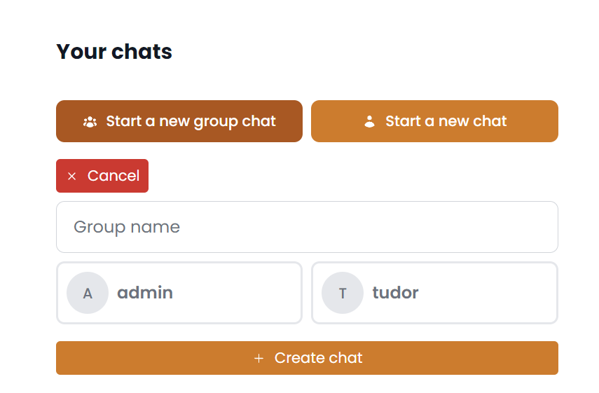
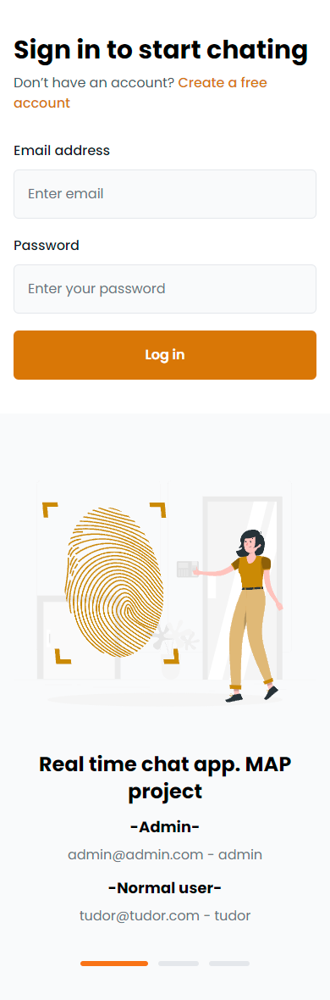

# Descriere Aplicație Chat - Proiect MAP

## Instalare
- **Cerințe:** Pentru a putea rula aplicația, este necesară instalarea [Docker](https://docs.docker.com/get-docker/) și [Docker Compose](https://docs.docker.com/compose/install/). Porturile 8000 și 3306 trebuie să fie libere. (8000 pentru aplicație și 3306 pentru baza de date)
- **Pasul 1:** Descarcă proiectul de pe GitHub folosind comanda `git clone` sau descarcă arhiva proiectului si extrage-o (unzip).
- **Pasul 2:** Deschide un terminal în directorul proiectului și rulează comanda ```docker-compose up --build```. Acest lucru va construi și rula containerele necesare pentru aplicație. (Procesul poate dura câteva minute bune)
- **Pasul 3:** După ce containerele sunt construite și rulate, in terminal vei vedea un mesaj de genul: ```INFO  Server running on [http://0.0.0.0:8000]. (Press CTRL+C to quit)```. Aplicația este acum disponibilă la adresa [http://127.0.0.1:8000](http://127.0.0.1:8000).
- **Pasul 4:** Dupa ce intri pe adresa de mai sus te poti conectat pe platforma cu utilizatorii pusi in pagina de login sau iti poti crea un cont nou.

## Caracteristici Principale

- **Mesagerie:** Aplicație de chat pentru trimiterea de mesaje.
- **Autentificare și Înregistrare:** Posibilitatea de a te autentifica și înregistra folosind adresa de email, un nume de utilizator și o parolă.


- **Profil Personalizabil:** Opțiunea de a personaliza și actualiza profilul.


- **Conversații Grup și Individuale:** Capacitatea de a crea grupuri de discuție alături de alți utilizatori, dar și de a iniția conversații individuale.


- **Trimiteți Mesaje în Grupuri:** Abilitatea de a trimite mesaje în cadrul grupurilor create.


- **Raportare Mesaje:** Posibilitatea de a raporta mesaje inadecvate.


- **Funcționalități de Administrator:** Ca administrator, poți vizualiza toți utilizatorii și ai opțiunea de a impune restricții (blocare).
- **Gestionarea Rapoartelor:** Poți accesa și evalua toate rapoartele primite de la alți utilizatori.


- **Disponibil pentru tablete si telefoane:** Aplicația este optimizată pentru a fi utilizată și pe dispozitive mobile. Având un design responsiv, interfața se adaptează în funcție de dimensiunea ecranului.





## Tehnologii Folosite

- **Laravel 10:** Backend-ul aplicației este dezvoltat folosind Laravel, un cadrul PHP puternic și versatil, care facilitează dezvoltarea rapidă și sigură a aplicațiilor web. (https://laravel.com/docs/10.x)

- **Livewire 3:** Interfața utilizator este creată cu ajutorul Livewire, un pachet pentru Laravel care permite dezvoltarea de componente dinamice fara a iesi din mediul Laravel. (https://livewire.laravel.com/docs/quickstart)

- **Tailwind CSS:** Design-ul aplicației se bazează pe Tailwind CSS, un framework CSS util și flexibil pentru crearea unei interfețe moderne și atractive. (https://tailwindcss.com/docs/installation)

- **MySQL:** Baza de date a aplicației este gestionată cu ajutorul MySQL, un sistem de gestionare a bazelor de date relaționale performant și fiabil. (https://dev.mysql.com/doc/)

- **Docker:** Aplicația este containerizată și poate fi ușor lansată folosind Docker, ceea ce face gestionarea și scalarea ei mai simplă și eficientă. (https://www.docker.com/)


### Resurse Folosite
- **Ilustratii:** [storyset](https://storyset.com/)
- **Componente:** [Flowbite](https://flowbite.com/) - [Preline](https://preline.co/index.html) - [tailbits](https://www.tailbits.com/)

<p align="center">
  &copy; 2023 Tudor Crisan | [tudor-crisan.com](https://tudor-crisan.com/)
</p>